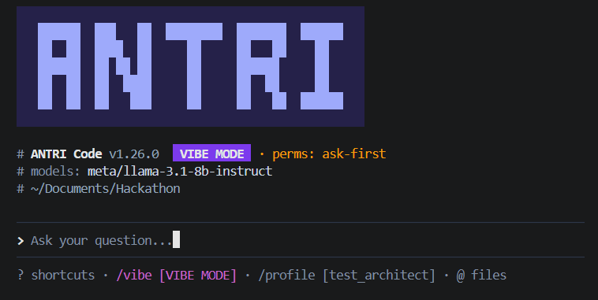
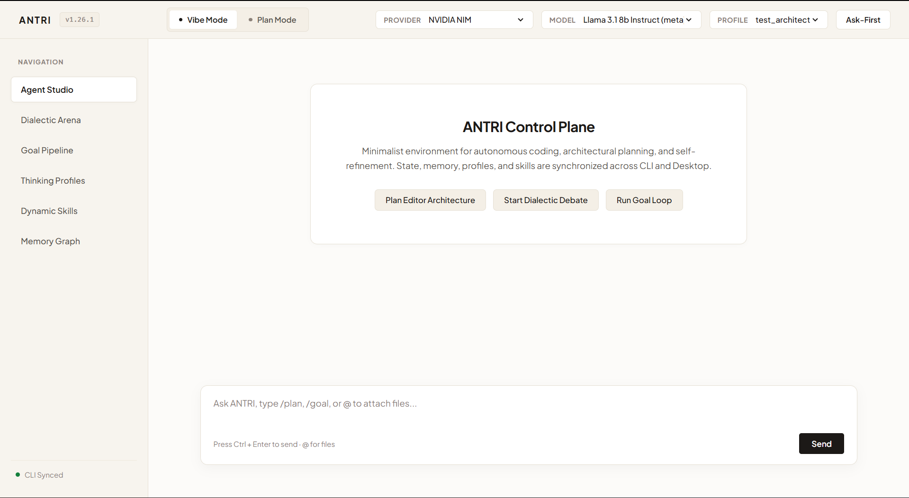

<div align="center">

# ANTRI Code (`antri_cli`)

**An intelligent, terminal-first AI coding chatbot, autonomous meta-agent, and desktop control plane inspired by OpenCode.**

[](https://www.npmjs.com/package/antri_cli)
[](LICENSE)
[](https://nodejs.org)

<br />


</div>

---

## Why ANTRI Code?

ANTRI Code turns your developer workspace into an integrated, autonomous coding ecosystem across the **Terminal CLI** and **Desktop Control Plane**. It doesn't just wait for prompts — it breaks tasks down step-by-step, asks clarifying questions on architecture trade-offs, runs multi-iteration self-improvement loops, debates solutions against itself to hunt edge cases, and writes its own custom dynamic tools.

---

## Visual Interfaces

### 1. Terminal CLI Interface
The lightning-fast, keyboard-driven terminal REPL with interactive `@` file attachment picking, mode badges, and instant response streaming.

<div align="center">
  
</div>

<br />

### 2. Desktop Control Plane
A minimalist cream-white desktop control center with visual agent studio, live dialectic debate cards, iterative goal pipelines, thinking profile editors, and memory graph inspectors.

<div align="center">
  
</div>

---

## Quick Start & One-Shot Setup

### Global Installation
Install globally from npm with a single command:

```bash
npm install -g antri_cli
```

### Launch Interactive CLI
Run `antri` anywhere in your terminal:

```bash
antri
```

### Launch Desktop Control Plane
Open the lightweight desktop control plane in app mode:

```bash
antri desktop
```
*(or type `/desktop` from inside the CLI)*

### Zero-Lockfile Self-Updating
Update globally to the latest version anytime:

```bash
antri update
```

---

## Key Highlights & Core Architecture

### 1. Plan Mode vs. Vibe Mode
- **Plan Mode (`/plan` or `antri --mode plan`)**: The agent enters an interactive blueprinting session. It analyzes architecture, drafts roadmaps, specifies file changes, and asks clarifying questions before making code edits.
- **Vibe Mode (`/vibe` or `antri --mode vibe`)**: Continuous conversational coding. The agent immediately writes code, creates files, executes tools, and builds solutions in real time.

### 2. Privacy & Security Tool Permission Gate
To safeguard your privacy and workspace integrity:
- Sensitive actions (web search, page scraping, shell execution, python runtime, dynamic skill authoring) prompt for explicit approval:
  ```text
  PRIVACY & SECURITY PERMISSION Agent requested tool execution: web_search
  Allow execution? [y: Yes / n: Deny / a: Always Allow]:
  ```
- Toggle permanently with `/alwaysallow` or start with:
  ```bash
  antri -alwaysallow
  ```

### 3. Autonomous Goal Loop (`/goal`, `/loop`, `antri --goal`)
Forces the agent through a multi-iteration self-refinement cycle:
1. **Stage 1 (Formulation)**: Drafts initial solution & code.
2. **Stage 2 (Adversarial Critique & Score)**: Critiques edge cases, security flaws, and assigns a 0-100% quality score.
3. **Stage 3 (Hardening & Synthesis)**: Synthesizes feedback into a battle-tested, optimal result.

```bash
antri --goal "Refactor user authentication to support distributed Redis sessions"
```

### 4. Multi-Profile Thinking System (`/profile`, `/notes`)
- Maintains distinct Markdown thinking profiles (`~/.antri/profiles/profile_1.md`, `profile_2.md`).
- **Interactive Profile Selector**: Switch profiles on the fly with `/profile`.
- **Live Note-Taking**: Observes your feedback and coding preferences during chat and compounds insights directly into the active profile.
- View captured notes anytime with `/notes`.

### 5. Dialectic Reasoning Engine (`/debate`, `antri --debate`)
Multi-persona self-debate pipeline arguing with itself before delivering consensus:
- **The Proposer (Thesis)**: Generates initial solutions and hypotheses.
- **The Adversary / Critic (Antithesis)**: Hunts bugs, assumptions, and logical flaws.
- **The Researcher (Verifier)**: Uses autonomous web tools to fact-check disputed claims in real time.
- **The Judge (Synthesis)**: Reconciles contradictions and outputs a robust answer.
- Configurable debate depth: `quick`, `deep`, or `rigorous` (`/depth <level>`).

### 6. Multi-Tiered Persistent Memory (Lifelong Learning)
- **Episodic Store**: Session transcripts and debate histories.
- **Semantic Memory**: Dense 128-dimensional vector store with cosine similarity.
- **Workspace Conventions**: Remembers repository-specific patterns (`.antri/conventions.md`).
- **Autonomous Self-Recall**: Queries past solutions before answering new prompts.
- `/memory` (inspect store) · `/consolidate` (run reflection) · `/learn <text>` (save rule).

### 7. The Meta-Agent (Autonomous Self-Evolution)
- **Sandboxed Python Runtime (`execute_python`)**: Safe execution of code snippets.
- **Autonomous Self-Debugging**: Intercepts stack traces, analyzes root causes, creates patches, and retries automatically.
- **Dynamic Skill Synthesis (`synthesize_skill`)**: The agent writes its own Python/JS tools, verifies them via dry-run, and persists them in `~/.agent-cli/skills/`.
- **Meta-Optimization (`/meta`)**: Tracks tool latency, success rates, and refines prompt heuristics.

### 8. Interactive `@` File Attachment Picker
Type `@` in the prompt box to trigger an interactive folder & file explorer. Navigate with arrow keys, hit Enter, and inject full file contexts directly into your conversation.

---

## Supported AI Providers & Model Suites

ANTRI includes built-in support for 11+ AI providers with dedicated model catalogs:

| Provider | Description | Notable Models |
|---|---|---|
| **Cerebras** | Ultra-fast ~2,000 tok/sec CS-3 inference | `llama-3.3-70b`, `llama3.1-70b`, `llama3.1-8b`, `qwen-2.5-coder-32b` |
| **Cohere** | Enterprise reasoning & citations | `command-r-plus-08-2024`, `command-r-08-2024`, `command-r7b-12-2024` |
| **Vortex API** | High-throughput GPU cluster | `vortex-llama-3.3-70b`, `vortex-deepseek-r1-full`, `vortex-deepseek-v3` |
| **OpenCode** | Dedicated coding & architecture | `opencode/deepseek-coder-v2.5`, `opencode/qwen2.5-coder-32b-instruct` |
| **DeepSeek** | Frontier open-weights & reasoning | `deepseek-chat` (V3), `deepseek-reasoner` (R1), `deepseek-v4-flash` |
| **NVIDIA NIM** | 100+ Live NIM API cloud functions | `meta/llama-3.1-8b-instruct`, `stepfun-ai/step-3.7-flash`, `nemotron-3` |
| **OpenAI** | Frontier reasoning & omni models | `gpt-4o`, `gpt-4o-mini`, `o1`, `o3-mini`, `gpt-4.5-preview` |
| **Anthropic** | Industry standard coding models | `claude-3-7-sonnet`, `claude-3-5-sonnet`, `claude-3-5-haiku` |
| **Google Gemini** | Massive context & agentic coding | `gemini-2.5-flash`, `gemini-2.5-pro`, `gemini-2.0-flash` |
| **Ollama** | Local offline GPU inference | `llama3.3:70b`, `qwen2.5-coder:32b`, `deepseek-r1:latest` |
| **Custom** | Custom endpoints | Any OpenAI-compatible server (`vLLM`, `LocalAI`, `LM Studio`) |

---

## CLI Commands & Slash Shortcuts

### Terminal CLI Options
```bash
antri                                # Launch interactive session
antri desktop                        # Launch desktop control plane
antri --mode plan                    # Launch in Plan Mode (collaborative architecture)
antri --mode vibe                    # Launch in Vibe Mode (direct coding flow)
antri -alwaysallow                   # Launch with tool permission prompts bypassed
antri update                         # Self-update to latest release without lockfile churn
antri -g, --goal "<task>"            # Run autonomous multi-iteration refinement loop
antri -d, --debate "<topic>"         # Run Dialectic multi-persona self-debate
antri --depth <quick|deep|rigorous>  # Set debate depth
antri -p, --prompt "<text>"          # Run one-shot query
antri -m, --model <name>             # Specify model
antri --provider <name>              # Specify provider
```

### Interactive REPL Slash Commands
| Command | Description |
|---|---|
| `/plan` | Switch to **Plan Mode** (collaborative architecture before coding) |
| `/vibe` | Switch to **Vibe Mode** (direct fast coding flow) |
| `/desktop` | Launch the **Desktop Control Plane** in standalone window |
| `/alwaysallow` | Toggle permission prompts for sensitive tools |
| `/goal [task]` | Run autonomous goal execution & refinement loop |
| `/loop [task]` | Alias for `/goal` loop |
| `/profile [name]` | Open interactive profile switcher or switch thinking profile |
| `/notes` | View active profile notes & recorded style insights |
| `/update` | Self-update ANTRI Code CLI |
| `/debate [query]` | Launch Dialectic multi-persona self-debate |
| `/depth <level>` | Set debate depth (`quick`, `deep`, `rigorous`) |
| `/connect` | Open interactive AI Provider selector |
| `/models` | Search and select from available models |
| `/tools` / `Ctrl+O` | Inspect recently executed workspace tools |
| `/skills` | List built-in and dynamically synthesized custom skills |
| `/meta` | View meta-optimization metrics and self-healing statistics |
| `/memory` | View persistent memory status across all tiers |
| `/consolidate` | Run reflection & knowledge compounding loop |
| `/learn <text>` | Manually record a rule or persistent insight |
| `/history` | View session conversation history |
| `/export [file]` | Export conversation transcript to Markdown |
| `/clear` | Start a clean new session |
| `/help` | Show command reference manual |
| `/exit` | Exit ANTRI Code |

---

## Environment Configuration

You can configure API keys using `/connect`, `/key <provider> <key>`, or by creating a `.env` file in your workspace:

```env
# Cerebras
CEREBRAS_API_KEY=csk-...

# Cohere
COHERE_API_KEY=...

# Vortex API
VORTEX_API_KEY=...

# OpenCode
OPENCODE_API_KEY=...

# DeepSeek
DEEPSEEK_API_KEY=sk-...

# NVIDIA NIM
NVIDIA_API_KEY=nvapi-...

# OpenAI
OPENAI_API_KEY=sk-...

# Anthropic Claude
ANTHROPIC_API_KEY=sk-ant-...

# Google Gemini
GEMINI_API_KEY=AIzaSy...

# Ollama (Local)
OLLAMA_BASE_URL=http://localhost:11434
```

---

## Local Development & Testing

```bash
# 1. Clone the repository
git clone https://github.com/ashu90-prog/antri_cli.git
cd antri_cli

# 2. Install dependencies
npm install

# 3. Build TypeScript & assets
npm run build

# 4. Run automated test suite (25 unit tests)
npm test

# 5. Run in dev mode
npm run dev
```

---

## License

Distributed under the **MIT License**. See `LICENSE` for more information.
