# 📚 ANTRI Code · Official Documentation

Welcome to the comprehensive documentation for **ANTRI Code** (`antri_cli` on npm) — the next-generation autonomous AI pair programming assistant, multi-agent dialectic system, lightweight desktop control plane, and cross-platform mobile client.

---

## 🧭 Documentation Sitemap & Navigation

| Document | Description |
| :--- | :--- |
| [**1. Getting Started**](./getting-started.md) | Installation, initial setup, API keys, and your first prompt. |
| [**2. CLI Reference & Shortcuts**](./cli-reference.md) | Full terminal flags, REPL interactive commands, keyboard shortcuts, and slash commands. |
| [**3. Modes: Plan vs. Vibe**](./modes.md) | Deep architectural planning protocols vs. direct, high-speed coding flow. |
| [**4. Desktop Control Plane**](./desktop-control-plane.md) | Complete guide to the 11-tab Desktop Web UI (`antri --desktop`). |
| [**5. Mobile App & PWA**](./mobile-app.md) | Flutter Native Client (`antri_flutter`) and mobile web server (`antri --mobile`). |
| [**6. Thinking Profiles & Memory**](./thinking-profiles-and-memory.md) | 4-tier persistent memory, markdown profiles, vector embeddings, and autonomous recall. |
| [**7. Markdown Skills Ecosystem**](./skills-ecosystem.md) | Specialist agent skills (`.md`), dynamic skill synthesis, and domain tools. |
| [**8. Codebase Breather Engine**](./codebase-breather.md) | Sub-second boot warmup, AST/dependency indexing, and zero-latency radar. |
| [**9. Interactive Artifacts & SPAs**](./artifacts-and-visuals.md) | Claude-style live artifacts: Markmap mind maps, Mermaid flowcharts, and rich web SPAs. |
| [**10. Multi-Agent Dialectic & Goal Loop**](./multi-agent-dialectic.md) | Adversarial debate arena (Proposer, Adversary, Researcher, Judge) and multi-day goal engine. |
| [**11. AI Providers & Model Catalog**](./providers-and-models.md) | Cerebras, Cohere, Vortex, OpenCode, DeepSeek, NVIDIA NIM, OpenAI, Anthropic, Gemini, and Ollama. |
| [**12. Self-Debugger & Project Fixer**](./self-debugger-and-fixer.md) | Autonomous self-healing, `antri fix` project repair engine, and health diagnostics. |
| [**13. Cloud Sync & Auth Gateway**](./cloud-sync-and-auth.md) | Google Cloud Firestore user partitions, browser login flow, and multi-device continuity. |
| [**14. API & Developer Guide**](./api-and-developer-guide.md) | Desktop REST/SSE endpoints, Node.js programmatic API, and contributor guidelines. |

---

## 🏛️ System Architecture Overview

ANTRI Code is built with a unified multi-tiered architecture that connects local development workflows with state-of-the-art AI inference and cross-device synchronization:

```mermaid
graph TD
    User["👤 Developer"] --> TerminalCLI["💻 Terminal CLI (antri)"]
    User --> DesktopUI["🖥️ Desktop Control Plane (:3000)"]
    User --> MobileApp["📱 Flutter Mobile Client (:3001)"]

    subgraph "Core Orchestration Engine"
        AgentLoop["🔄 Agent Loop & Dual-Delivery"]
        CodebaseBreather["🫁 Codebase Breather & Cache"]
        DialecticArena["⚔️ Multi-Agent Dialectic Arena"]
        GoalLoop["🎯 Goal Loop Engine"]
        SelfDebugger["🛠️ Autonomous Self-Debugger"]
    end

    subgraph "4-Tier Persistent Memory"
        Episodic["📜 Episodic Memory (JSON)"]
        Semantic["🔍 Semantic Vectors (128-D)"]
        Profiles["👤 Thinking Profiles (.md)"]
        WorkspaceNotes["📝 Workspace Directives (notes.md)"]
    end

    subgraph "AI Inference Layer"
        NIM["⚡ NVIDIA NIM"]
        Cerebras["⚡ Cerebras CS-3"]
        Cohere["⚡ Cohere Command R+"]
        Vortex["⚡ Vortex Cluster"]
        OpenCode["⚡ OpenCode"]
        DeepSeek["⚡ DeepSeek R1/V3"]
        OpenAI["⚡ OpenAI GPT-4o"]
        Anthropic["⚡ Anthropic Claude"]
        Gemini["⚡ Google Gemini"]
        Ollama["⚡ Ollama Local"]
    end

    subgraph "Cloud & Synchronization"
        Firestore["🔥 Google Cloud Firestore Partition"]
        AuthGate["🔒 Zero-Trust Auth Gateway"]
    end

    TerminalCLI --> AgentLoop
    DesktopUI --> AgentLoop
    MobileApp --> AgentLoop

    AgentLoop --> CodebaseBreather
    AgentLoop --> DialecticArena
    AgentLoop --> GoalLoop
    AgentLoop --> SelfDebugger

    AgentLoop --> Episodic
    AgentLoop --> Semantic
    AgentLoop --> Profiles
    AgentLoop --> WorkspaceNotes

    AgentLoop --> NIM
    AgentLoop --> Cerebras
    AgentLoop --> Cohere
    AgentLoop --> Vortex
    AgentLoop --> OpenCode
    AgentLoop --> DeepSeek
    AgentLoop --> OpenAI
    AgentLoop --> Anthropic
    AgentLoop --> Gemini
    AgentLoop --> Ollama

    Profiles --> Firestore
    WorkspaceNotes --> Firestore
    AuthGate --> Firestore
```

---

## ⚡ Quick Feature Matrix

- **100% TypeScript ESM**: Clean NodeNext architecture with native module imports.
- **Anti-Shallow Mandate**: Generates production-ready code with complete logic, TypeScript interfaces, defensive error boundaries, and zero stub placeholders.
- **Dual-Delivery Output**: Every frontend or full-stack query writes actual files to your working directory and simultaneously renders interactive live previews.
- **Sub-Second Warmup**: Analyzes your project tree, entrypoints, and dependencies in 1.2s on startup and injects intelligence into the LLM system prompt.
- **Autonomous Error Recovery**: Catches syntax errors, missing arguments, or rate limits in real-time, auto-heals parameters, and retries seamlessly.

---

👉 Jump to [**Getting Started**](./getting-started.md) to begin using ANTRI Code.
