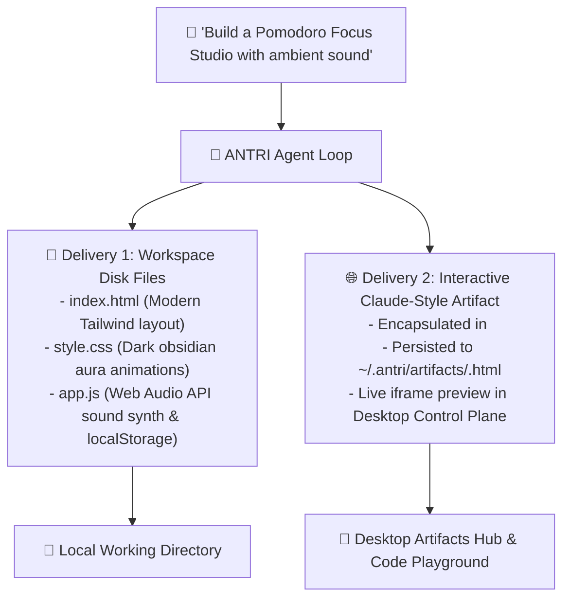

# 🎨 Interactive Artifacts & Dual-Delivery Engine

ANTRI Code features a Claude-style **Artifact Management Engine** (`src/core/artifactManager.ts`) paired with a **Dual-Delivery Protocol**. Whenever you request a frontend interface, mind map, architecture diagram, or full-stack application, ANTRI produces both production-ready disk files in your workspace and interactive visual artifacts for instant browser testing.

---

## 🏛️ The Dual-Delivery Paradigm

---

## 📦 Supported Artifact Types

### 1. 🌐 Single-Page Applications (`type="app"`)
- Full-featured, responsive web applications built with Tailwind CSS, Google Fonts, and Lucide icons.
- Includes functional logic (e.g., HTML5 Web Audio API synthesizers, canvas graphics, local storage persistence).
- No external npm install required for instant previewing.

### 2. 🧠 Markmap Mind Maps (`type="mindmap"`)
- Dynamic, interactive, collapsible mind maps rendered using the Markmap SVG rendering engine.
- Perfect for visualizing complex topic hierarchies, system architectures, or technical study guides.

### 3. 📊 Mermaid Architecture Graphs (`type="graph"`)
- Flowcharts, sequence diagrams, class diagrams, and state machines rendered with Mermaid.js.
- Clean dark-mode obsidian styling with zoom and pan controls.

---

## 🖥️ Viewing and Managing Artifacts

- **List Artifacts in REPL**: `/artifacts`
- **Open Live Artifact in Browser**: `/view <artifact-id>` (e.g. `/view art_focus_flow`)
- **Desktop Artifacts Hub**: Browse the visual artifact gallery in Tab 7 of the Desktop Control Plane.
- **Responsive Playground**: Test artifacts on simulated Desktop (1920x1080), Tablet (768px), and Mobile (375px) viewports in Tab 10.

---

👉 Next: Explore the multi-agent debate system in [**Multi-Agent Dialectic & Goal Loop**](./multi-agent-dialectic.md).
