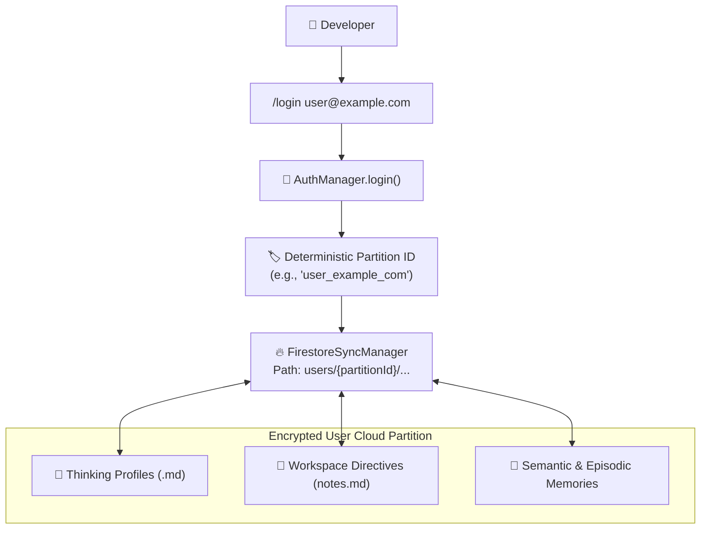

# 🔒 Cloud Sync & Zero-Trust Auth Gateway

ANTRI Code provides secure, cross-device state synchronization powered by **Google Cloud Firestore** (`src/cloud/firestore.ts`) and a **Zero-Trust User Partition Architecture**.

---

## 🏛️ Partition Security & Privacy Architecture



---

## 🔑 Authentication Workflow

### Logging In
Log in with your developer email to activate encrypted cloud synchronization:
- Terminal CLI:
  ```bash
  antri login developer@antri.ai
  ```
- Inside REPL:
  ```text
  /login developer@antri.ai
  ```
- Desktop UI: Click the **Account / Login** button in the header.

### Logging Out
To disconnect your cloud partition and switch to offline local storage:
```text
/logout
```

---

## 🔄 Multi-Device Synchronization Guarantee

When authenticated, any modification made on your workstation is automatically synchronized to your other devices:
- **Profile Updates**: Modifying a thinking profile in the Desktop Control Plane synchronizes immediately to the Flutter mobile app.
- **Project Directives**: Workspace conventions recorded in `notes.md` follow you across multiple machines.
- **Session Continuity**: Multi-chat sessions and memory nuggets remain consistent across terminal, desktop, and mobile.

---

👉 Next: Review developer APIs and contributing instructions in [**API & Developer Guide**](./api-and-developer-guide.md).
