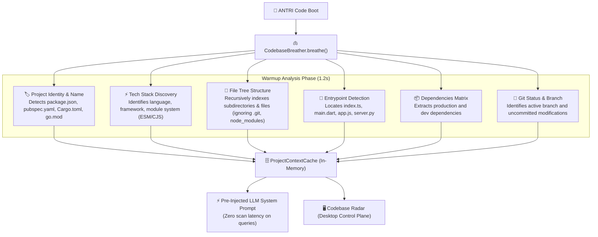

# 🫁 Codebase Breather & Intelligence Cache Engine

The **Codebase Breather** (`src/core/codebaseBreather.ts`) is a startup warmup engine that solves one of the biggest friction points in AI coding assistants: **repetitive, slow codebase scanning**.

---

## ⚡ How It Works

When ANTRI Code boots in your terminal or desktop environment, the Breather executes a rapid, non-blocking 1.2-second warmup phase with an animated pulsation indicator:

```text
- ✨ ANTRI is breathing... Analyzing "Hackathon" architecture & indexing context...
✔ ✨ [ANTRI Breathed]: Indexed antri_cli (TypeScript, ESM, Chalk) · 185 files · Cache Warm
```



---

## 🎯 Key Advantages

1. **Zero-Latency Inquiries**: When you ask "How does our authentication middleware work?", ANTRI already knows the file location (`src/auth/middleware.ts`) without spending 5 seconds running `find_files` or `list_dir`.
2. **Context-Rich System Prompt**: Automatically provides the LLM with the exact tech stack, typing conventions, and framework version, eliminating hallucinations.
3. **Instant Desktop Radar**: Powers Tab 9 (**Codebase Intelligence Radar**) in the Desktop Control Plane with real-time stats and visual trees.

---

## 🔄 Re-Breathing (`/breathe`)

If you add new dependencies, create new subdirectories, or switch git branches, you can instantly refresh the cache:
- Inside REPL: `/breathe`
- Desktop UI: Click the **"🫁 Breathe & Re-Index Codebase"** button on the Codebase Radar tab.

---

👉 Next: Discover the dual-delivery artifact system in [**Interactive Artifacts & SPAs**](./artifacts-and-visuals.md).
