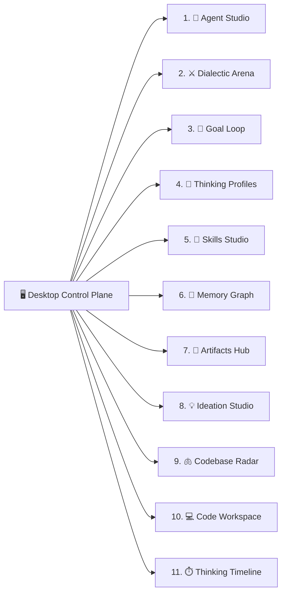

# 🖥️ Desktop Control Plane (`antri --desktop`)

The **ANTRI Desktop Control Plane** is a lightweight, responsive browser-based developer studio served locally on port `3000`. It provides a mission control center with 11 specialized engineering tabs for managing multi-agent reasoning, codebase intelligence, live artifacts, and persistent memory.

---

## 🚀 Launching Desktop Mode

Start the desktop server from your terminal:
```bash
antri --desktop
```
This automatically initializes `DesktopServer` (in `src/desktop/server.ts`) and opens `http://localhost:3000` in your default web browser.

---

## 🎛️ The 11 Specialized Engineering Tabs



### 1. 💬 Agent Studio (Main Chat)
- Full-screen dual-stream chat interface with real-time SSE (Server-Sent Events).
- Integrated model selector (NVIDIA NIM, Cerebras, Cohere, Vortex, DeepSeek, OpenAI, Anthropic, Gemini, Ollama).
- Mode toggle button (Plan vs. Vibe) and Always-Allow privacy toggle.
- Interactive permission prompt overlay for sensitive shell commands.

### 2. ⚔️ Dialectic Arena (Multi-Agent Debate)
- Visual adversarial debate arena where 4 specialized sub-agents deliberate over complex technical questions:
  - **Proposer**: Advocates the primary architectural direction.
  - **Adversary**: Challenges vulnerabilities, security gaps, and hidden complexity.
  - **Researcher**: Fetches real-world benchmarks, documentation, and CVEs.
  - **Judge**: Synthesizes a unified architectural verdict.

### 3. 🎯 Goal Loop (Autonomous Multi-Step Execution)
- Visual tracking for long-running engineering objectives.
- Breaks goals into 3 stages: Exploration, Execution, and Verification.
- Real-time step progress badges and iteration logs.

### 4. 👤 Thinking Profile Studio
- Create, inspect, edit, and switch between Markdown-based Thinking Profiles (`~/.antri/profiles/*.md`).
- Live preview of User Preferences, Architectural Style, Music Hobbies, and Directives.
- One-click profile activation and real-time cloud synchronization.

### 5. 🧩 Markdown Skills Studio
- Visual repository of installed agent skills (`~/.antri/skills/`).
- Inspect YAML frontmatter, trigger keywords, and execution instructions.
- Create custom domain skills or import community skills.

### 6. 🧠 Lifelong Memory Graph
- Visual explorer for the 4-tier cognitive memory hierarchy:
  - **Episodic Memory Logs**: Chronological table of queries and responses.
  - **128-D Semantic Vectors**: Clustered knowledge nuggets with similarity scores.
  - **Workspace Conventions**: Active project rules from `.antri/profiles/notes.md`.
  - **Background Consolidation**: One-click "Consolidate Memory" button.

### 7. 🎨 Claude-Style Artifacts Hub
- Interactive gallery of all generated artifacts:
  - Interactive Markmap mind maps.
  - Mermaid architecture flowcharts and ER diagrams.
  - Single-Page Applications (SPAs) with Tailwind CSS, Lucide icons, and Web Audio synthesizers.
- Live iframe previews with Fullscreen, Popout, and Code Inspector modes.

### 8. 💡 Ideation Studio & Project Suggestions
- Curated library of 1-click project blueprints (Real-time collaborative whiteboards, distributed rate limiters, WebAssembly DSP engines).
- Custom prompt builder with instant "🚀 Build This Idea" button that prefills chat.

### 9. 🫁 Codebase Intelligence Radar
- Visual repository diagnostics:
  - Total indexed files, active language stack chips, and subsystem file tree.
  - Detected entrypoints and package dependency matrix.
  - "🫁 Breathe & Re-Index Codebase" button with real-time breathing animation.

### 10. 💻 Live Code Workspace & Playground
- Multi-file workspace directory tree browser (`/api/workspace/tree`).
- In-browser code editor with syntax highlighting and instant file saving (`POST /api/workspace/file`).
- Live HTML/JS sandbox preview with responsive viewport toggles (**Desktop 1920x1080**, **Tablet 768px**, **Mobile 375px**).

### 11. ⏱️ Autonomous Thinking Timeline
- 5-stage timeline visualizer:
  1. *Context Ingestion & Breather Cache*
  2. *Dialectic & Architectural Synthesis*
  3. *Tool Execution & Dual-Delivery*
  4. *Self-Debugging & Repair Verification*
  5. *Lifelong Episodic & Semantic Consolidation*

---

👉 Next: Learn about the mobile companion in [**Mobile App & PWA**](./mobile-app.md).
