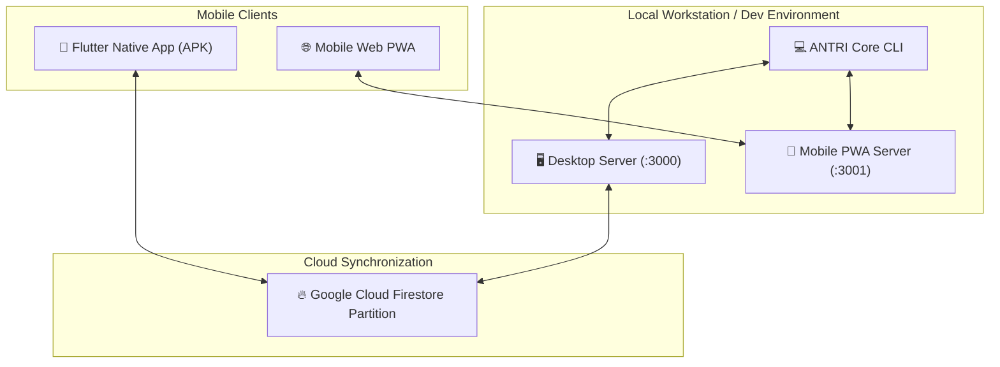

# 📱 Mobile App & PWA Companion

ANTRI Code provides dual mobile access options: a **Flutter Native Android Client** (`antri_flutter`) and a **Standalone Mobile Web PWA Server** (`antri --mobile`). Both clients share state, lifelong memory, thinking profiles, and real-time execution logs with your desktop terminal.

---

## 🏗️ Mobile Architecture



---

## 1. 📱 Flutter Native Client (`antri_flutter`)

The Flutter client is a native cross-platform application designed for fast, tactile interaction on Android and iOS devices.

### Key Capabilities
- **Real-Time Agent Monitoring**: Streams reasoning tokens and tool execution status via WebSockets and HTTP/SSE.
- **Thinking Profile Synchronizer**: Syncs custom markdown profiles and directives directly with Firestore partitions.
- **Cognitive Memory Inspector**: Browse episodic query logs and semantic vector knowledge items on mobile.
- **Glassmorphism Mobile UI**: Obsidian dark aura theme with custom gradient cards, smooth animations, and tactile haptics.

### Running & Building the Flutter Client
To run locally on a connected Android device or emulator:
```bash
cd antri_flutter
flutter run
```

To build a release APK:
```bash
cd antri_flutter
flutter build apk --release
```
The compiled APK will be output to `antri_flutter/build/app/outputs/flutter-apk/app-release.apk`.

---

## 2. 🌐 Standalone Mobile Web PWA (`antri --mobile`)

For devices without the native Flutter app installed, ANTRI provides a built-in mobile web companion server.

### Starting Mobile Server
```bash
antri --mobile
```
This starts an HTTP/SSE server on port `3001` (`http://localhost:3001`).

### PWA Features
- **Zero Install Requirement**: Access immediately via any mobile browser (Safari, Chrome, Firefox).
- **Add to Home Screen**: Installable as a Progressive Web App (PWA) with offline asset caching and manifest icons.
- **Mobile Mode Switcher**: Toggle between Plan Mode and Vibe Mode with dedicated mobile touch buttons.
- **Quick Action Triggers**: Instant buttons for `/plan`, `/vibe`, `/arch`, `/fix`, and `/new`.

---

👉 Next: Read about the 4-tier memory architecture in [**Thinking Profiles & Memory**](./thinking-profiles-and-memory.md).
