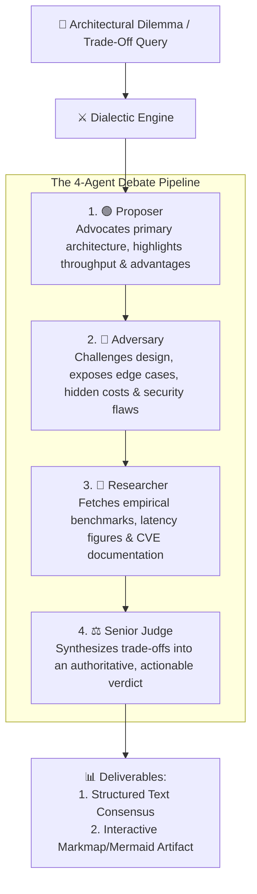
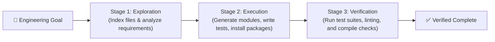

# ⚔️ Multi-Agent Dialectic & Goal Loop Engine

ANTRI Code features an advanced multi-agent orchestration architecture that moves beyond single-turn prompt answering. Complex architectural trade-offs and multi-day engineering goals are resolved using specialized sub-agent pipelines: the **Dialectic Arena** and the **Goal Loop Engine**.

---

## 1. ⚔️ The Multi-Agent Dialectic Arena (`src/core/dialectic.ts`)

When addressing nuanced architectural dilemmas (e.g., "Should we use Kafka or RabbitMQ for our order processing event bus?"), ANTRI deploys a 4-agent adversarial debate:

### Triggering a Dialectic Debate
- Command: `/debate <topic>` (e.g. `/debate Microservices vs Monolith for Seed Stage Startup`)
- Desktop: Tab 2 (**Dialectic Arena**) with visual agent message cards and live debate transcripts.

---

## 2. 🎯 The Autonomous Goal Loop Engine (`src/core/goalLoop.ts`)

For long-running, multi-step engineering missions (e.g., "Scaffold a complete authentication system with JWT, refresh tokens, and rate limiting"), the Goal Loop executes a 3-stage iterative optimization protocol:

### Key Capabilities
- **Silent Background Execution**: Runs multi-step tasks with clean header badges (`⚡ [Goal Loop: Step 2/3]`).
- **Autonomous Error Interception**: If a compilation or test fails during Stage 3, the Goal Loop loops back to Stage 2 with failure context to self-heal.
- **Trigger**: `/goal <objective>` (e.g. `/goal Refactor database queries to use indexed Prisma batch operations`).

---

👉 Next: View the AI inference provider catalog in [**AI Providers & Model Catalog**](./providers-and-models.md).
