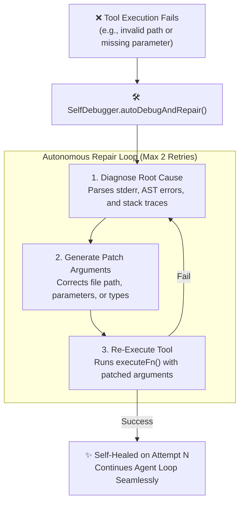

# 🛠️ Self-Debugger & Project Fixer Engine

ANTRI Code incorporates an autonomous **Self-Debugger Loop** (`src/core/debugger.ts`) and a specialized **Project Bug Fixer** (`src/core/fixer.ts`) that detect, isolate, and repair broken code, API crashes, and tool execution failures without requiring developer intervention.

---

## 1. 🔄 Autonomous Self-Debugger (`SelfDebugger`)

When any tool execution fails (e.g., a file write fails due to missing directory, a Python script throws a syntax error, or an API argument is malformed), the Self-Debugger intercepts the failure:



---

## 2. 🩺 Autonomous Project Bug Fixer (`antri fix`)

The **Project Bug Fixer** (`src/core/fixer.ts`) is a dedicated CLI and REPL tool designed to scan an entire repository, identify syntax/type errors, locate broken dependencies, and patch them automatically:

### Running the Bug Fixer
- Terminal command:
  ```bash
  antri fix
  ```
- Inside REPL:
  ```text
  /fix
  ```

### What It Checks & Repairs
1. **Compilation & Build Failures**: Runs `tsc`, `npm run build`, or `flutter analyze` to capture build errors.
2. **Missing Dependencies**: Detects unresolved imports and updates `package.json` / `pubspec.yaml`.
3. **Broken Tests**: Runs the project test runner (`npm test`, `pytest`, `cargo test`) and rewrites failing unit tests.
4. **Security & Privacy Gates**: Enforces authentication checks before making workspace-wide modifications.

---

## 3. 🩺 System Doctor (`/selfheal`)

If ANTRI Code encounters environment or network issues, run `/selfheal` to perform end-to-end system health checks:
```text
> /selfheal

🩺 ANTRI System Health & Self-Healing Diagnostics
═════════════════════════════════════════════════════════════════
  ✔ Global configuration directory exists (~/.antri)
  ✔ AI Provider 'nvidia-nim' configured with active API key
  ✔ Chat session storage integrity verified
  ✔ Workspace write permissions verified
═════════════════════════════════════════════════════════════════
✨ ANTRI is 100% Healthy and Ready!
```

---

👉 Next: Learn about cloud synchronization in [**Cloud Sync & Auth Gateway**](./cloud-sync-and-auth.md).
