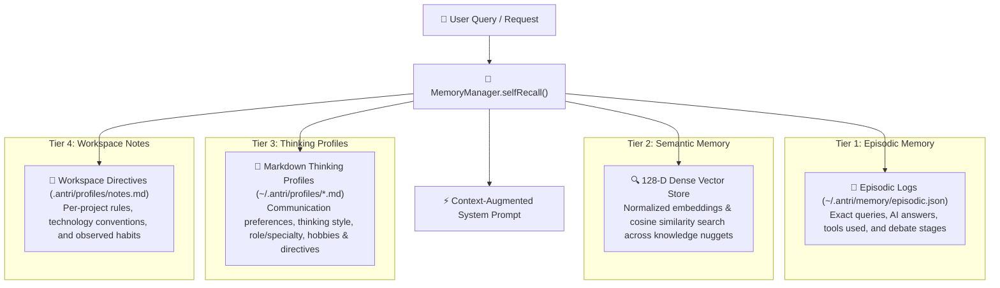

# 🧠 Thinking Profiles & 4-Tier Memory Architecture

ANTRI Code features a persistent cognitive architecture that evolves alongside the developer. Rather than treating each session as an isolated blank slate, ANTRI utilizes a **4-tier memory hierarchy** to recall past architectural decisions, adapt to user communication nuances, enforce workspace conventions, and compound knowledge over time.

---

## 🏛️ The 4-Tier Memory Hierarchy



---

## 1. 📜 Tier 1: Episodic Memory
- **Location**: `~/.antri/memory/episodic.json`
- **Purpose**: Retains chronological interaction history across sessions.
- **Data Captured**: Query text, full AI response, executed tools, dialectic debate stages, and timestamps.
- **Search Method**: Keyword search and semantic cross-referencing to find related past interactions.

---

## 2. 🔍 Tier 2: 128-D Semantic Vector Memory
- **Location**: `~/.antri/memory/semantic.json`
- **Purpose**: Indexes generalized lessons, architectural patterns, and reusable code solutions.
- **Engine**: Dense vector store (`src/memory/vectorStore.ts`) generating 128-dimensional normalized embeddings.
- **Retrieval**: High-speed cosine similarity search with relevance thresholds (`similarity >= 0.28`).

---

## 3. 👤 Tier 3: Markdown Thinking Profiles
- **Location**: `~/.antri/profiles/<profile_name>.md`
- **Purpose**: Defines who you are and how ANTRI should think, reason, and communicate with you.

### Structure of a Thinking Profile
```markdown
# 👤 Profile: software_architect

## 📋 Profile Info
- Profile Name: software_architect
- Description: Principal Systems & Distributed Backend Architect
- Role / Specialty: High-Throughput Distributed Systems, Rust, TypeScript, Go

## 🧠 User Thinking Style & Preferences
- Communication Style: Concise, direct, data-driven, first-principles logic
- Problem Solving Approach: Test-driven development, defensive error boundaries
- Code Style & Architecture: Strict typing, zero unnecessary dependencies, modular ESM

## 🎯 User Hobbies & Interests
- Hobbies: Ambient modular synthesizer music, espresso brewing
- Technical Interests: Quantum computing, eBPF kernel tracing, zero-copy networking

## 📝 Personal Notes & Directives
- Always include strict TypeScript interfaces and validation schemas.
- Never write stub functions or omit error handling.
```

### Profile Commands
- `/profile` — View active profile and stats.
- `/profile <name>` — Switch active profile (e.g. `/profile frontend_dev`).
- `/profiles` — Interactive profile switcher.

---

## 4. 📝 Tier 4: Workspace Notes & Conventions
- **Location**: `.antri/profiles/notes.md` (Workspace-local) and `~/.antri/profiles/notes.md` (Global)
- **Purpose**: Automatically captures codebase-specific rules and user nuances during natural conversation.
- **Adaptive Extraction**: The `ProfileManager.extractAndRecordNotes` engine automatically detects and records:
  - User identity (Name, background, project role).
  - Code conventions (e.g., "Use Zustand instead of Redux in this repo").
  - Hobbies and personal preferences (e.g., music tastes, favorite toolchains).
  - Explicit directives (e.g., "Always use Tailwind for styling").

---

## 🔄 Autonomous Self-Recall Protocol

Before every query, `MemoryManager.selfRecall()` runs seamlessly in the background:
1. Performs vector search across semantic knowledge nuggets.
2. Finds relevant past episodic conversations.
3. Ingests active Thinking Profile rules and Workspace Notes.
4. Formats and injects a `[🧠 Recalled Memory & Knowledge Base Context]` block directly into the LLM system prompt.

---

## 🧹 Background Memory Consolidation

Over time, raw episodic conversations can accumulate noise. Running `/consolidate` or triggering the consolidation engine (`src/memory/consolidation.ts`) performs automated knowledge distillation:
- Aggregates multi-turn logs into concise lessons learned.
- Indexes crystallized knowledge into 128-D vector semantic memory.
- Prunes duplicate entries to keep memory retrieval fast and laser-focused.

---

👉 Next: Explore specialist agent skills in [**Markdown Skills Ecosystem**](./skills-ecosystem.md).
