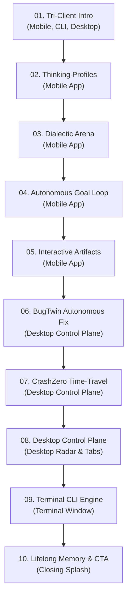

# 🎬 ANTRI Code — Flagship Features Showcase Script (Screen-Recording Edition)

> **Total Duration**: ~2:30 (10 Tight, High-Impact Flagship Blocks · ~15s each)  
> **Strict Focus**: ONLY the Major Power Features — No Minor Commands or Fluff  
> **Key Showcase Elements**:
> 1. **Tri-Surface Clients** (Mobile App, Terminal CLI, Desktop Panel)
> 2. **Thinking Profiles** (On Mobile)
> 3. **Dialectic Arena (Self-Debate)** (On Mobile)
> 4. **Autonomous Goal Loop** (On Mobile)
> 5. **Interactive Artifacts & Mind Maps** (On Mobile)
> 6. **BugTwin Engine** (On Desktop Panel)
> 7. **CrashZero Time-Travel Debugger** (On Desktop Panel)
> 8. **Desktop Control Plane** (On Desktop Panel)
> 9. **Terminal CLI** (On CLI Window)
> 10. **Lifelong Memory & Outro** (Closing CTA)

---

## ⏱️ Flagship Video Flow



---

## 🎬 Step-by-Step Live Screen-Recording Guide

### ⏱️ [0:00 – 0:15] Act 1: The Three Unified Clients (Mobile, CLI, Desktop)
- **Active Window**: **Window A (Mobile View)** $\rightarrow$ Alt+Tab to **Window C (CLI)** $\rightarrow$ Alt+Tab to **Window B (Desktop)** $\rightarrow$ Return to **Window A (Mobile)**.

**👉 Screen Actions**:
1. Start recording with the **Flutter Mobile App** centered on screen.
2. Quick Alt+Tab to show the **Terminal CLI** with the chunky purple `ANTRI` banner.
3. Quick Alt+Tab to show the **Desktop Control Plane** with its 11-tab sidebar.
4. Alt+Tab back to **Mobile** for the core demo.

**🎙️ Voiceover**:
> *"Welcome to ANTRI Code—an autonomous AI coding ecosystem built natively on Google Gemini 3.7. ANTRI unifies three powerful interfaces: a native touch-optimized mobile client, a lightning-fast terminal CLI, and an 11-tab desktop control plane."*

---

### ⏱️ [0:15 – 0:30] Act 2: Thinking Profiles & Cognitive Adaptation
- **Active Window**: **Window A (Mobile View)**.

**👉 Screen Actions**:
1. Tap top-left hamburger menu **(☰)** in the mobile app.
2. Tap **Thinking Profiles**.
3. Smoothly scroll through `profile_1.md` showing extracted rules (*e.g., "Prefers strict TypeScript types, functional immutability, zero-boilerplate design"*).

**🎙️ Voiceover**:
> *"ANTRI continuously learns how you code. Its silent background engine captures your architectural worldview, design patterns, and framework conventions into Markdown Thinking Profiles, automatically personalizing every future AI response to your exact standards."*

---

### ⏱️ [0:30 – 0:45] Act 3: Dialectic Arena (Multi-Persona Self-Debate)
- **Active Window**: **Window A (Mobile View)**.

**👉 Screen Actions**:
1. In the mobile drawer, tap **Dialectic Arena**.
2. In the debate topic input, paste: `PostgreSQL vs Redis for high-throughput session caching` and tap **Start Debate**.
3. Point mouse at the four live persona cards streaming simultaneously: **Proposer (Thesis)**, **Adversary (Antithesis)**, **Researcher (Verification)**, and **Judge (Consensus)**.

**🎙️ Voiceover**:
> *"For complex architectural decisions, ANTRI features the **Dialectic Arena**. Four specialized AI personas debate in real-time—proposer, adversary, researcher, and judge—clashing ideas to deliver battle-tested, consensus-hardened technical recommendations without bias."*

---

### ⏱️ [0:45 – 1:00] Act 4: Autonomous Goal Loop & 3-Stage Pipeline
- **Active Window**: **Window A (Mobile View)**.

**👉 Screen Actions**:
1. In the drawer, tap **Goal Loop**.
2. In the goal box, paste: `Build an end-to-end OAuth2 token refresh pipeline` and tap **Run Goal**.
3. Watch the animated 3-stage progress bar advance: **Draft Scaffolding $\rightarrow$ Adversarial Critique $\rightarrow$ Hardened Implementation**.

**🎙️ Voiceover**:
> *"The autonomous **Goal Loop** moves beyond simple one-shot prompts. ANTRI executes a multi-iteration self-refinement pipeline—drafting solutions, subjecting them to harsh automated critique, and polishing the code until it reaches production-grade quality."*

---

### ⏱️ [1:00 – 1:15] Act 5: Interactive Artifacts & Visual Mind Maps
- **Active Window**: **Window A (Mobile View)**.

**👉 Screen Actions**:
1. Open the mobile drawer, tap **Artifacts** (directly above `+ New Chat`).
2. Tap **View Artifact** on a generated Single Page App to show clickable buttons and live timers.
3. Tap on a **Mind Map** artifact — pinch/drag to demonstrate the pan & zoom gestures on the dark cyber neon Mermaid diagram.

**🎙️ Voiceover**:
> *"Artifacts transform responses into live software. ANTRI generates self-contained interactive web apps, runnable calculators, and dynamic Mermaid mind maps with full pinch-to-zoom support, all grouped neatly by conversation in the mobile Artifacts Hub."*

---

### ⏱️ [1:15 – 1:30] Act 6: Desktop Spotlight: BugTwin Autonomous Test & Fix
- **Active Window**: **Alt+Tab to Window B (Desktop Control Plane)**.

**👉 Screen Actions**:
1. Switch to the **Desktop Control Plane** browser window.
2. Click the **🧬 BugTwin Reproduce** quick pill button (or run `/reproduce TypeError: Cannot read property`).
3. Point cursor at the generated minimal reproduction script running Red (🔴), the automated patch diff, and the Green verification pass (🟢) inside the visual stage.

**🎙️ Voiceover**:
> *"On Desktop, **BugTwin** revolutionizes debugging. Feed it any error or crash: BugTwin autonomously synthesizes a minimal red reproduction test, authors a surgical patch, and re-executes the suite to prove verified green resolution in a visual sandbox."*

---

### ⏱️ [1:30 – 1:45] Act 7: Desktop Spotlight: CrashZero Time-Travel Debugger
- **Active Window**: **Window B (Desktop Control Plane)**.

**👉 Screen Actions**:
1. In Desktop, click the **⏱️ CrashZero Replay** quick pill button.
2. Point cursor at the de-minified production stack trace.
3. **Click and drag the Scrubbable Time-Travel Slider** back and forth across execution timestamps to inspect variable states leading to the crash.

**🎙️ Voiceover**:
> *"For production incidents, **CrashZero** turns raw stack traces into interactive time-travel incident replays. Scrub backwards through execution timestamps, inspect variable states frame-by-frame, and generate verified pull requests with zero guesswork."*

---

### ⏱️ [1:45 – 2:00] Act 8: Desktop Control Plane: Radar & Viewports
- **Active Window**: **Window B (Desktop Control Plane)**.

**👉 Screen Actions**:
1. Click the **🫁 Codebase Radar** tab on the left sidebar to show interactive file dependency graphs.
2. Click the **💻 Code Workspace** tab to show live code file inspection and editing.
3. In the Artifacts Stage, click the device toggles (**🖥️ Desktop**, **📱 Tablet**, **📲 Mobile**) showing instant responsive adaptation.

**🎙️ Voiceover**:
> *"The Desktop Control Plane is your 11-tab mission control. Visualize full architectural dependency trees with Codebase Radar, edit code in Code Workspace, and test responsive UI artifacts across one-click device viewport toggles."*

---

### ⏱️ [2:00 – 2:15] Act 9: Terminal CLI & Dynamic Skills
- **Active Window**: **Alt+Tab to Window C (Terminal CLI)**.

**👉 Screen Actions**:
1. Switch to the **Terminal CLI** window.
2. Press `/` to trigger the interactive `prompt_toolkit` popup menu, use arrow keys down and up.
3. Hit Enter to run `/skills` showing synthesized dynamic Python skills.

**🎙️ Voiceover**:
> *"For keyboard purists, the **Terminal CLI** delivers pure speed. Featuring an interactive slash-command autocomplete menu, surgical codebase tools, and the power for the agent to synthesize its own custom executable Python skills dynamically."*

---

### ⏱️ [2:15 – 2:30] Act 10: Lifelong Vector Memory & Wrap-Up
- **Active Window**: **Mobile App / CLI side-by-side**.

**👉 Screen Actions**:
1. In mobile/CLI, type `/learn "Always use TypeScript strict mode"` and hit Enter.
2. Point cursor at the green **Firestore Synced** status indicator.
3. Show closing slide / terminal banner displaying: **`npm install -g antri_cli`** · **Powered by Google Gemini 3.7**.

**🎙️ Voiceover**:
> *"With lifelong vector memory and real-time Google Cloud Firestore synchronization, your project context follows you everywhere. Experience the future of autonomous agentic coding with ANTRI Code—install globally from npm today."*

---

## 📋 Copy-Paste Sheet for Recording

```text
Act 3 (Debate): PostgreSQL vs Redis for high-throughput session caching
Act 4 (Goal):   Build an end-to-end OAuth2 token refresh pipeline
Act 6 (BugTwin): Click 🧬 BugTwin Reproduce
Act 7 (CrashZero): Click ⏱️ CrashZero Replay
Act 10 (Learn): /learn "Always use TypeScript strict mode"
```
